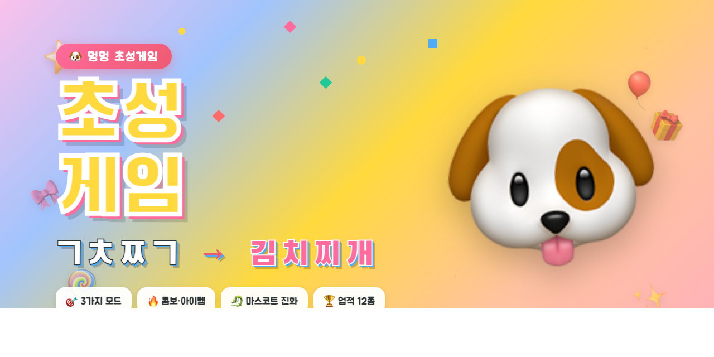

# 🐶 멍멍 초성게임 (Meong-Meong Chosung)

> 한글 단어의 **초성**(첫 자음)만 보고 정답을 맞히는 두뇌 웹 게임
> `ㄱㅊㅉㄱ` → **김치찌개** 🍲



🎮 **[지금 바로 플레이하기 →](https://jackykimsungsu.github.io/meong-meong-chosung/)**

[](.)
[](.)
[](.)

---

## ✨ 주요 기능

### 🎮 3가지 게임 모드
- 🎯 **클래식** — 무작위 10문제, 골든 라운드(점수 2배) 등장
- 💀 **서바이벌** — 라이프 3개로 무한 도전, 5문제마다 시간 단축
- ⚡ **스피드런** — 60초 안에 최대한 많이 맞히기

### 🎁 게임적 재미 요소
- **콤보 시스템** — 연속 정답 시 점수 보너스 + 화려한 효과
- **아이템 드롭** — ⏱️ 시간 +5초 / 👁️ 글자 공개 / 💎 더블 점수
- **골든 라운드** — 가끔 등장하는 점수 2배 라운드 ✨
- **마스코트 진화** — 🐶 → 🦊 → 🐺 → 🦁 → 🐉 (점수에 따라)
- **업적 시스템** — 12종 배지, 달성 시 토스트 알림 🎖️
- **최고 기록 저장** — localStorage로 모드별 베스트 점수 보관 🏆

### 🎨 풍부한 UI/UX
- 그라데이션 배경 애니메이션 + 떠다니는 도형들
- 정답 시 **컨페티 효과** + 점수 팝업 애니메이션
- 마스코트 표정/말풍선 변화로 즐거움 UP
- 효과음 (Web Audio API, 외부 파일 불필요) 🔊
- 모바일 반응형 디자인 📱

### 📂 10개 카테고리 · 총 440+ 단어
🍔 음식 · 🐶 동물 · 🌏 나라 · ⚽ 스포츠 · 🎬 영화 · 🏠 생활
🎤 K-POP · 💼 직업 · 🏙️ 한국지역 · 🥕 과일·채소

### 🔥 3단계 난이도
😊 쉬움 (30초/힌트3) · 😎 보통 (20초/힌트2) · 🥵 어려움 (10초/힌트1)

---

## 🚀 실행 방법

### 1. 로컬 서버로 실행 (권장)

```bash
# Python 3
python3 -m http.server 8765

# 또는 Node.js (http-server 설치)
npx http-server -p 8765
```

브라우저에서 [http://localhost:8765](http://localhost:8765) 접속

### 2. 그냥 파일로 열기

`index.html`을 브라우저로 직접 열어도 동작합니다 (단, 효과음이 일부 환경에서 제한될 수 있습니다).

---

## 📁 프로젝트 구조

```
meong-meong-chosung/
├── index.html         # 게임 화면 구조
├── style.css          # 스타일 + 애니메이션
├── game.js            # 게임 로직 (모드/아이템/업적/저장)
├── words.js           # 카테고리별 단어 사전 + 초성 추출 함수
├── HOW_TO_PLAY.md     # 상세 게임 방법 가이드
└── README.md          # 이 문서
```

---

## 🛠 기술 스택

- **순수 HTML/CSS/JavaScript** — 외부 라이브러리·빌드 도구 없음
- **Web Audio API** — 효과음 동적 생성 (파일 불필요)
- **localStorage** — 최고 기록 및 업적 저장
- **CSS Animations** — 컨페티, 진화 연출, 그라데이션 등
- **Korean Font** — Black Han Sans, Jua, Noto Sans KR

---

## 🎯 핵심 알고리즘: 초성 추출

```javascript
function getChosung(text) {
  const CHO = ['ㄱ','ㄲ','ㄴ','ㄷ','ㄸ','ㄹ','ㅁ','ㅂ','ㅃ',
               'ㅅ','ㅆ','ㅇ','ㅈ','ㅉ','ㅊ','ㅋ','ㅌ','ㅍ','ㅎ'];
  let result = '';
  for (const ch of text) {
    const code = ch.charCodeAt(0);
    if (code >= 0xAC00 && code <= 0xD7A3) {
      // 한글 음절: (코드 - 0xAC00) / 588 = 초성 인덱스
      result += CHO[Math.floor((code - 0xAC00) / 588)];
    } else {
      result += ch;
    }
  }
  return result;
}
```

한글 유니코드 범위(`0xAC00`~`0xD7A3`)에서 각 음절은
`(초성 × 588) + (중성 × 28) + 종성` 구조이므로 588로 나누면 초성 인덱스가 나옵니다.

---

## 📜 게임 방법

자세한 점수 시스템·업적 조건·꿀팁은 [HOW_TO_PLAY.md](./HOW_TO_PLAY.md) 참고!

---

## 📝 라이선스

MIT License — 자유롭게 사용·수정·재배포 가능합니다.

---

즐거운 초성 풀이 되세요! 멍멍! 🐾
